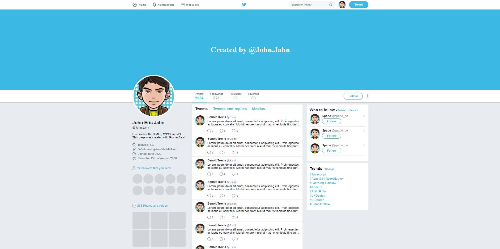

<h1 align="center">:bird: Twitter Flexbox :bird:</h1>

<p align="center">	
  <a href="www.linkedin.com/in/john-eric-jahn">
    
  </a>
  
  </a>
</p>

## 💻 Project

A clone of the twitter interface, built to learn best practices with CSS3 and FlexBox.

## 🔖 Layout

<p align="center">
  
</p>

## :rocket: Technologies

This project was developed with the following techs:
- **[HTML5]**
- **[CSS3]**
- **[Flexbox]**

## :information_source: How-To-Use

For being a static page you just need to clone this repository and run it on your computer.

From your command line:
```bash
# Clone this repository
$ git clone https://github.com/JohnEricJahn/Twitter-Layout-Clone
```

## :memo: Licença
This repository is licensed by MIT LICENSE.
